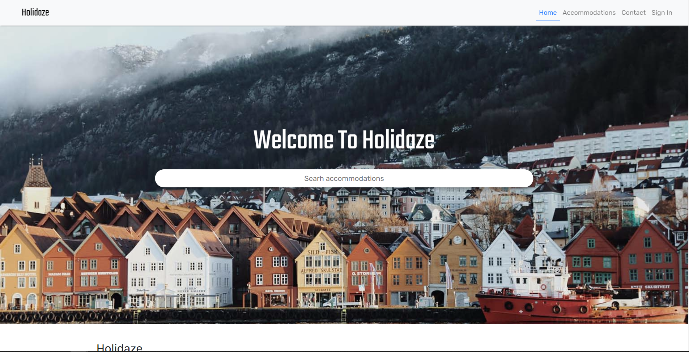

- Username = admin
- Password = password123

# Holidaze



This project is a imaginary booking site located in Bergen called Holidaze. The site also includes a admin section for adding new accommodations and to list messages from the contact form and enquiries from bookings.

## Description

Holidaze is a booking website located in Bergen Norway. The main section of the website is open for all users and allows them to search all the accommodations on the site, add a booking for a hotel and send messages through the contact form. The site also has a admin section which can be accessed by the correct username and password on the sign in form. In this section you can add new accommodations and read messages that users has submitted in the contact form and enquiries from bookings.

The website includes:

- Home page with searchbar to search all accommodations
- Accommodation page that displays all accommodations and a searchbar and a dropdown to filter searches.
- Accommodation detail page that displays the accommodation you clicked with information and a booking modal to send a inquiry.
- Contact page with contact form.
- Sign in page to get access to admin section.
- Admin page with form for adding new accommodations, and sections for displaying messages from contact form and enquiries from the booking modal.

## Built With

The tech stack used for this project:

- [React.js](https://reactjs.org/)
- [Bootstrap](https://getbootstrap.com)
- [Sass](https://sass-lang.com/)
- [React Router Dom](https://reactrouter.com/)
- [React Hook Form](https://react-hook-form.com/)
- [@hookform/resolvers](https://www.npmjs.com/package/@hookform/resolvers)
- [React Helmet](https://www.npmjs.com/package/react-helmet)
- [React Date Range](https://hypeserver.github.io/react-date-range/)
- [Axios](https://axios-http.com/docs/intro)

## Getting Started

### Installing

To get the project starting you need to first clone the repo. After this you will need to change the capital letters of the file name in your local files to lowercase before installing the dependencies.

1. Clone the repo:

```bash
git clone https://github.com/Noroff-FEU-Assignments/project-exam-2-TomAnKing.git
```

2. Install the dependencies:

```
npm install
```

### Running

To run the app, run the following command:

```bash
npm start
```

## Contributing

If you want to make any contributions to this project please commit changes to your own branch and submit a pull request so your changes can be reviewed and approved before published.

## Contact

If you have any questions regarding this project or want to contact me you can send me an email or send me a message on instagram.

- tommy996633@gmail.com

- [Instagram](https://www.instagram.com/tomanking/)

## Acknowledgments

This project is made in the context of an exam at Noroff School of technology which has helped with good knowledge and tutoring.
